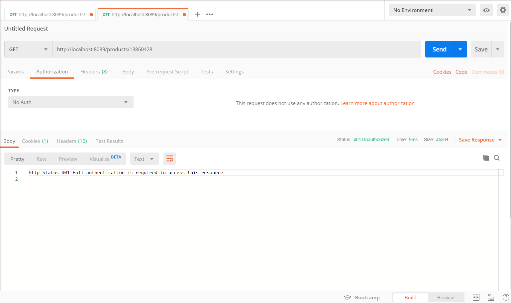
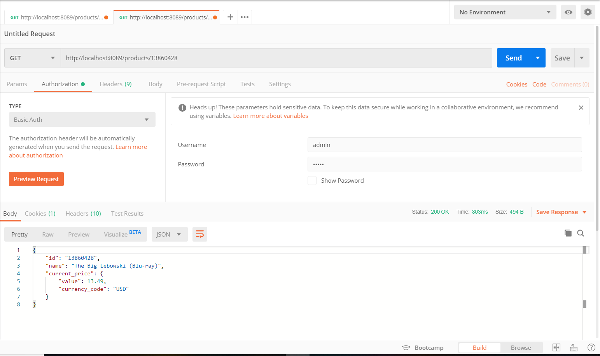
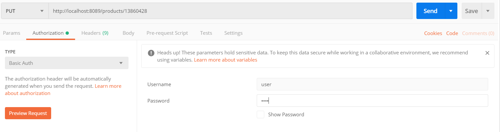
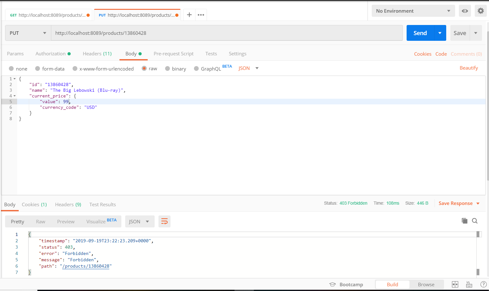
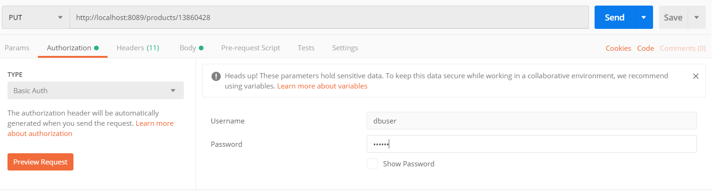
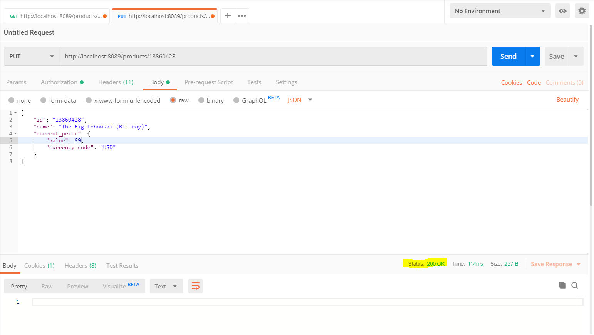
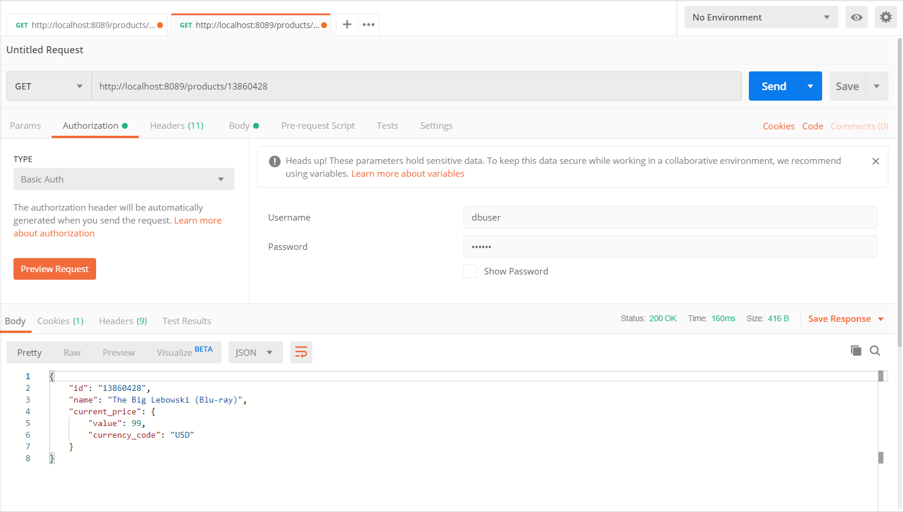
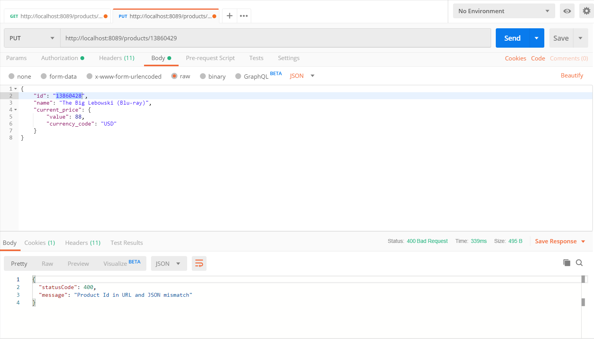
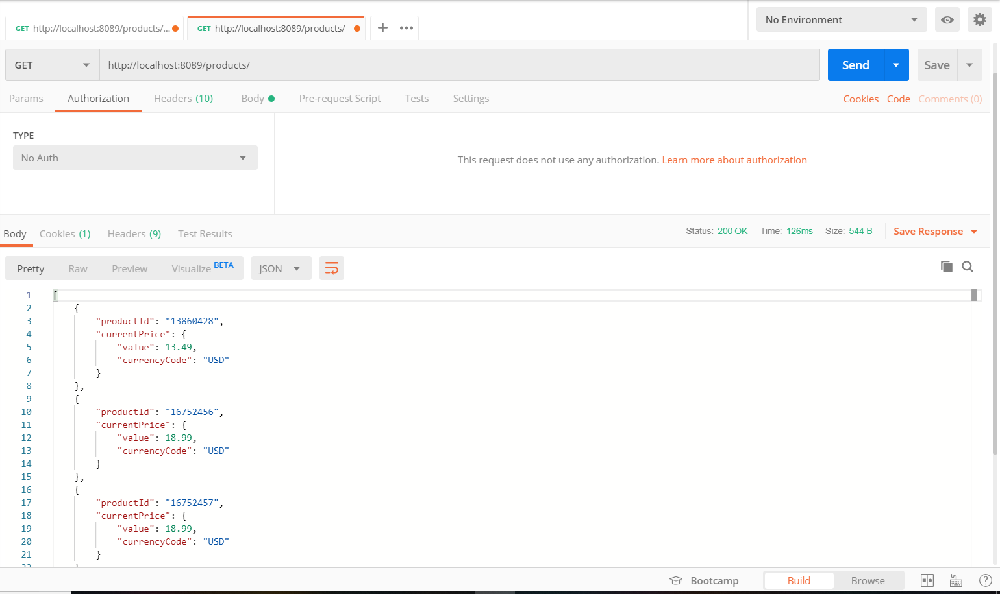

# myRetail
myRetail is a rapidly growing company with HQ in Richmond, VA and over 200 stores across the east coast.
 myRetail wants to make its internal data available to any number of client devices, from myRetail.com to
  native mobile apps. The goal for this exercise is to create an end-to-end Proof-of-Concept for a products API,
   which will aggregate product data from multiple sources and return it as JSON to the caller.
    Your goal is to create a RESTful service that can retrieve product and price details by ID.
     The URL structure is up to you to define, but try to follow some sort of logical convention.
     Build an application that performs the following actions:
      * Responds to an HTTP GET request at /products/{id} and delivers product data as JSON (where {id} will be a number.
      * Example product IDs: 15117729, 16483589, 16696652, 16752456, 15643793) 
      * Example response: {"id":13860428,"name":"The Big Lebowski (Blu-ray) (Widescreen)","current_price":{"value": 13.49,"currency_code":"USD"}}Performs an HTTP GET to retrieve the product name from an external API. (For this exercise the data will come from redsky.target.com, but let’s just pretend this is an internal resource hosted by myRetail) 
      * Example: http://redsky.target.com/v2/pdp/tcin/13860428?excludes=taxonomy,price,promotion,bulk_ship,rating_and_review_reviews,rating_and_review_statistics,question_answer_statistics
      * Reads pricing information from a NoSQL data store and combines it with the product id and name from the HTTP request into a single response.
      * BONUS: Accepts an HTTP PUT request at the same path (/products/{id}), containing a JSON request body similar to the GET response, and updates the product’s price in the data store

####Solution:

#### Tech Stack:
Springboot , Maven, Mockito/Junit, RestTemplate, Embedded MongoDB, swagger2.

#### Github Repository:
Download project from the following git repository
https://github.com/nrajuri/myRetail.git

#### To run the application:
Download the project. Navigate to  the project folder and run mvn spring-boot:run
Read the API documentation in Swagger2 (run http://localhost:8089/swagger-ui.html on the browser)

#### MyRetail API Solution provides the ability to:
* Retrieve product and price information by Product Id.
* Update the price information in the database.
* Type of authentication - Basic Auth.
* One rest end point is not secure/authenticated.
                               Method               Request                   Credentials
                                 GET              /products/{id}              [SECURE -- user/user]
                                 PUT              /products/{id}              [SECURE -- admin/admin, dbuser/dbuser]
				                 GET              /products                   [NOT SECURE]

#### Output Results
* Retrieve product details with no authentication.

* Retrieve product details with proper authentication.

* Update price details with "USER" role. (eg:user/user)

* Update price with "ADMIN" role. (eg: admin/admin, dbuser/dbuser)

* Retrieve updated product details.

* Mismatch in update body and path parameter error.

* Fetching all productId details without authentication.(Just to show authentication levels for different end points
, would not implement in production in this way.)

